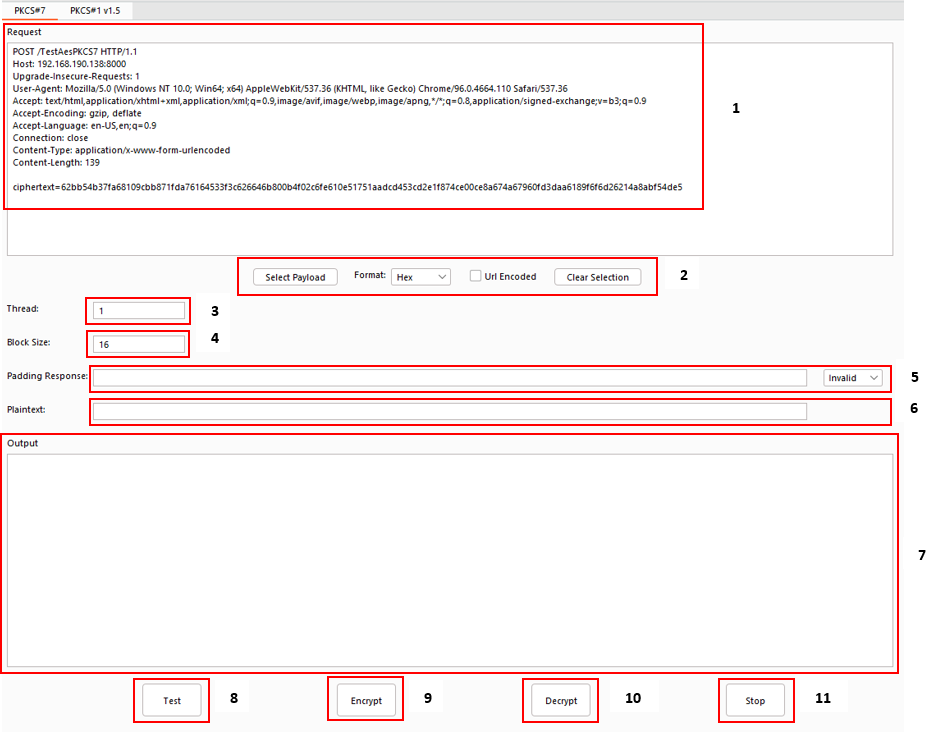
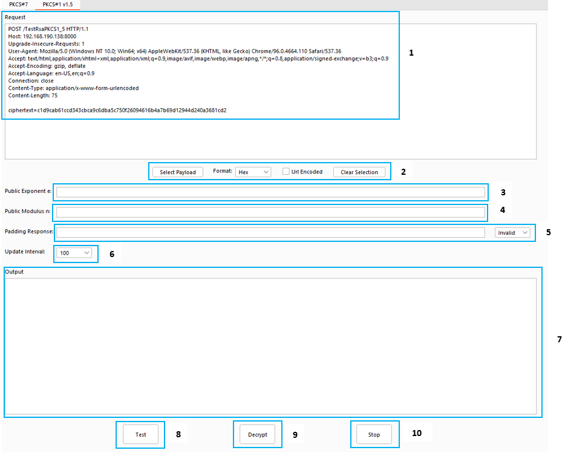
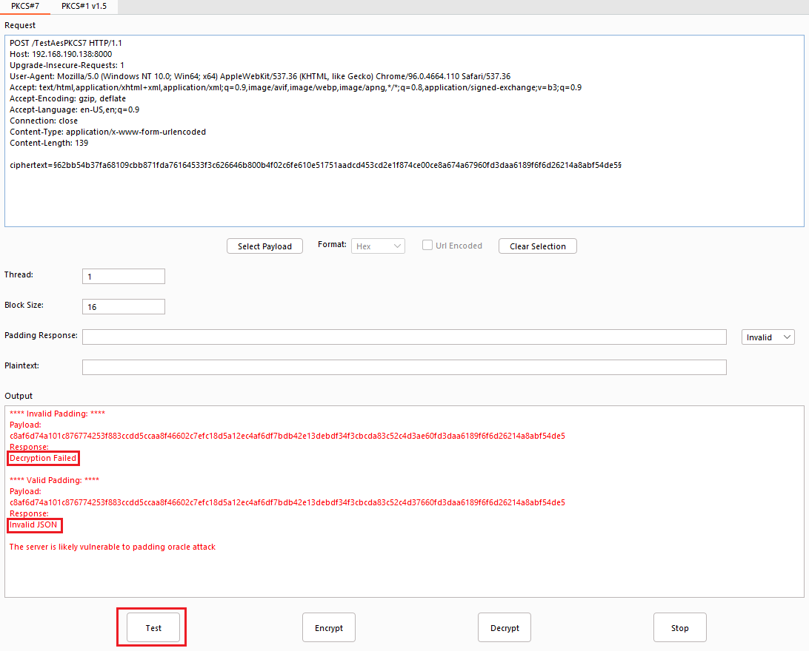
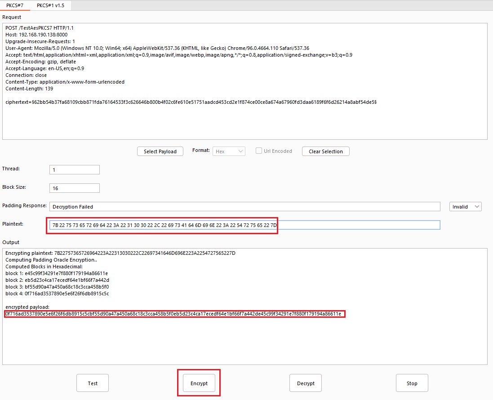
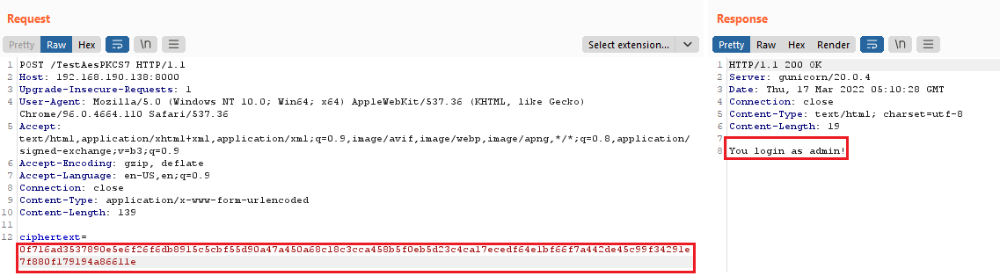
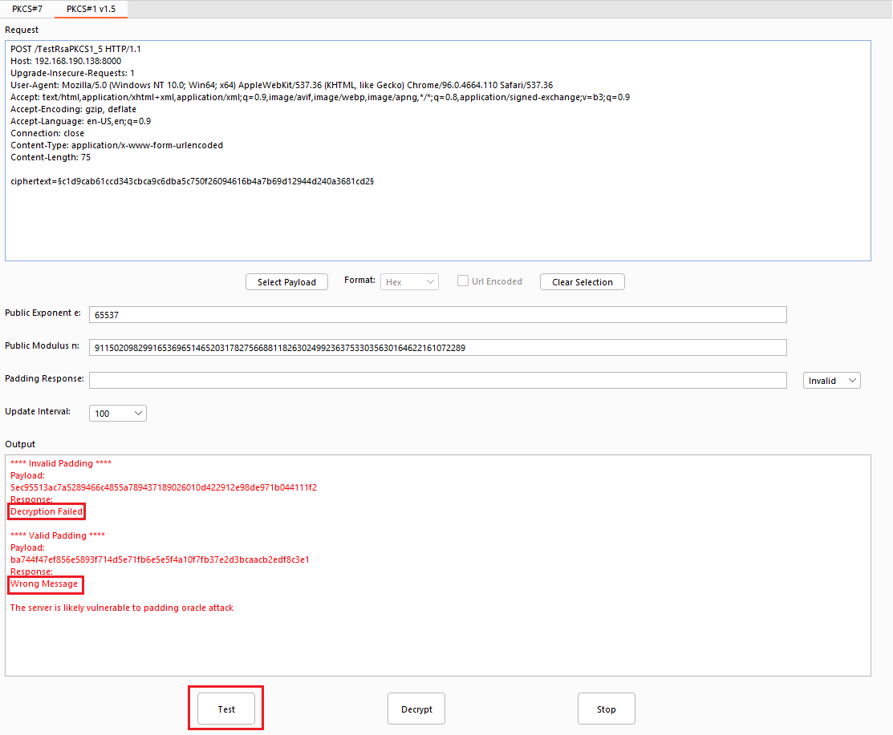

# Padding Oracle Hunter #

Padding Oracle Hunter is a Burp Suite extension that helps penetration testers quickly identify and exploit the PKCS#7 and PKCS#1 v1.5 padding oracle vulnerability.

# Features #
Currently, the extension consists of 2 separate tabs **PKCS#7** and **PKCS#1 v1.5**, which support the following functionalities:

## PKCS#7 ##
The following GUI can be used to identify and perform the padding oracle attack targeting the PKCS#7 padding scheme on CBC block cipher. The attack allows plaintext recovery and modification without knowing the key.

	 
The components of the GUI (above) are as follows:
1. Http request window.
2. Panel to select the payload and its format. To achieve full decryption, the payload is expected to be in the format of IV || ciphertext.
3. The number of threads used to perform the attack. With more threads, the computation is expected to be faster.
4. The block size of the encryption protocol.
5. The unique response from the server (partial or full) due to valid or invalid padding. Only used in the encryption and decryption operations.
6. The plaintext which will be used to compute the ciphertext. Only used in the encryption operation.
7. Output window.
8. Test function to verify whether the server is vulnerable to PKCS#7 padding oracle attack.
9. Encrypt function to compute the ciphertext from the given plaintext.
10. Decrypt function to recover the plaintext from the encrypted payload.
11. Stop function to halt all the current operations.

## PKCS#1 v1.5 ##
The following GUI can be used to identify and perform the padding oracle attack targeting the PKCS#1 v1.5 padding scheme on RSA Cryptosystem. The attack allows the plaintext to be recovered with only the public key information.

The components of the GUI (above) are as follows:
1. Http request window.
2. Panel to select the payload and its format.
3. The RSA public exponent.
4. The RSA public modulus.
5. The unique response from the server (partial or full) due to valid or invalid padding. Only used in the decryption operation.
6. Interval to display the decryption results.
7. Output window.
8. Test function to verify whether the server is vulnerable to PKCS#1 v1.5 padding oracle attack.
9. Decrypt function to recover the plaintext from the encrypted payload.
10. Stop function to halt all the current operations.

# Prerequisites #
 - <a href="http://portswigger.net/burp/download.html">Burp Suite</a> 
 - <a href="https://www.jython.org/download.html">Jython</a>

# Installation #
## Burp ##
- Clone this repository.
- From the Burp, select **Extender -> Options -> Python Environment -> Select File -> select the Jython standalone JAR file**
- From the Burp, select **Extender -> Extensions -> Add -> Select Extension type: Python and Extension file: padding_oracle_hunter.py**
- Click **Next** and ensure the installation is completed without errors. If everything goes well, the **Padding Oracle Hunter** tab will be created in the Burp.

## Test Vulnerable Server ##
- A test server was created to simulate the padding oracle vulnerability.
- To set up the server, **clone this repository -> go inside the TestVulServer directory -> run docker-compose up**
- The server can be accessed through http://ServerIP:8000 

# Usage #
## PKCS#7 ##
1. Go to the test server endpoint at http://ServerIP:8000/TestAesPKCS7 with the following **POST** request and notice we login as a normal user.

2. Pipe the request through **Extensions -> Padding Oracle Hunter -> PKCS#7**

3. Select the ciphertext value in the **Request** window, click **Select Payload** with **Hex** format, and **Url Encoded uncheck**. The payload will be enclosed within the **§** symbol.

4. Click the **Test** button, and it will provide a summary indicating the server is vulnerable to padding oracle attack.

5. Copy either part/full of the padding response from the **Output** window and put it in the **Padding Response** textbox. You can choose to use either the valid or invalid padding response. Click the **Decrypt** button to recover the plaintext.

6. In order to escalate the privilege to admin, we will need to modify the plaintext to **{"userid":"100","isAdmin":"True"}** and convert it to a hexadecimal value.

7. Copy the hexadecimal value to the **Plaintext** textbox and click the **Encrypt** button to compute the corresponding ciphertext.

8. Update the http request with the newly computed ciphertext and send the request to the server. Notice that we are now login as an admin.

## PKCS#1 v1.5 ##
1. Go to the test server endpoints at http://ServerIP:8000/TestRsaPKCS1_5 with the following **POST** request.

2. Pipe the request through **Extensions -> Padding Oracle Hunter -> PKCS#1 v1.5**

3. Select the ciphertext value in the **Request** window, click **Select Payload** with **Hex** format, and **Url Encoded uncheck**. The payload will be enclosed within the **§** symbol.

4. Fill in the public key parameters with `public exponent: 65537` and `modulus: 91150209829916536965146520317827566881182630249923637533035630164622161072289`

5. Click the **Test** button, and it will provide a summary indicating the server is vulnerable to padding oracle attack.

6. Copy either part/full of the padding response from the **Output** window and put it in the **Padding Response** textbox. You can choose to use either the valid or invalid padding response. Click the **Decrypt** button, and the plaintext will be recovered at about 50k requests.

# Contributing #

 * If you find bugs, kindly log us an [issue ticket](https://github.com/govtech-csg/PaddingOracleHunter/issues) to report them. Do ensure that the bug has not already been reported by searching on GitHub under Issues.
 * If you have any recommendations that you think could improve the tool, we welcome you to contribute. Together we can make Padding Oracle Hunter more useful to the community.
## Submitting changes
Please send a [GitHub Pull Request to us](https://github.com/govtech-csg/PaddingOracleHunter/pull/new/master) with a clear list of what you have done and the potential impact to the tool if there is any.
